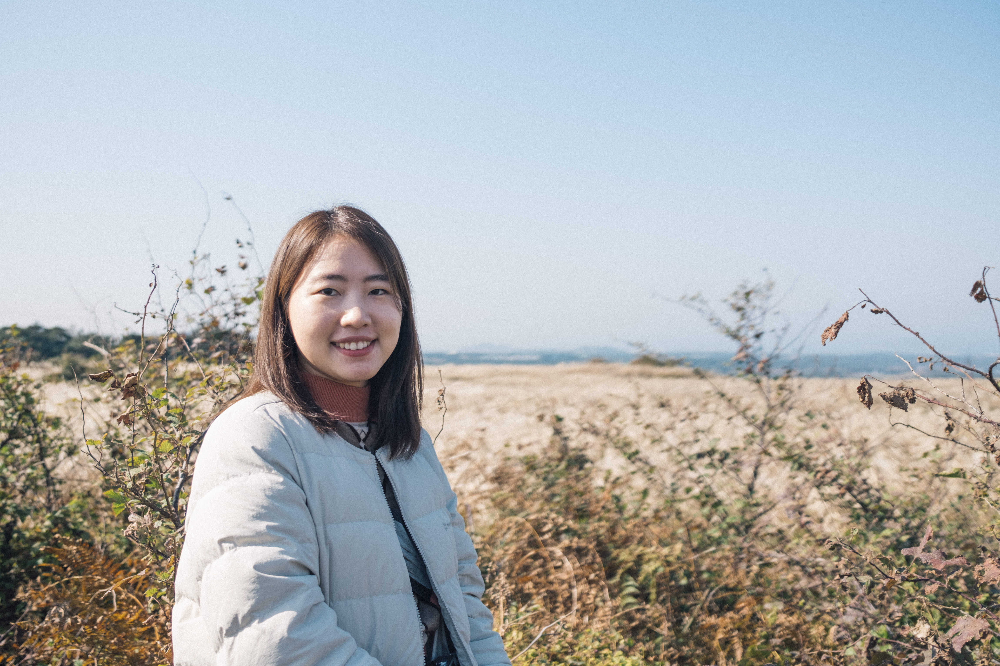

## 안녕하세요. 
데이터를 요리조리 다루어 사용자에게 
필요한 것을 만드는 박수진입니다.

창의력 수학 교재 개발과 분석한 경험을 토대로
주어진 데이터를 어떻게 가치 있게 만드는 것에 고민하는 것을 좋아합니다. 
데이터 분석과 예측, 자연어 처리에 대해 호기심이 많아
끊임없이 배우는 것을 즐깁니다. 

# 👩🏻‍💻 Projects

### [1. **[AIFFEL X SOCAR] 생성형 챗봇**](https://www.notion.so/AIFFEL-X-SOCAR-8131783586cf41cc99f6a4db2b03ddd5)

- 현재 쏘카의 고객문의 챗봇을 개선하기 위해, 관련 데이터로 학습한 생성형 챗봇을 만들어 사용자 편의를 높임
- NLP로 사용자의 문의를 해석하고 답변을 생성하는 부분을 구현
- CV, Image2Text를 통해 고객이 올린 사진을 인식하여 문제에 대한 분류를 구현
- 고객과 채팅, 업로드된 이미지를 기반으로 필요한 답을 생성하는 챗봇 구현

### [2. [**경진대회**] **제주도 도로 교통량 예측**](https://www.notion.so/40c65577c29b46b585cc8712a5b060d9)

- 제주도의 교통 정보로부터 도로별 평균 속도의 회귀 예측을 하는 대회
- EDA를 통해 예측에 필요한 Feature를 찾고, AutoML을 이용해 회귀 모델 최적화

### [3. [AIFFEL] ****브라질 Olist 이커머스 분석****](https://www.notion.so/AIFFEL-Olist-1274c332683841a387300229c8757278)

- 브라질 Olist 이커머스 데이터를 이용해 다양한 시각화와 입점하려는 판매자에게 유용한 정보를 주는 목표

# 👋 Contact

✉️ suqkr12@gmail.com 
💬 [GitHub](https://github.com/darkhairlove)